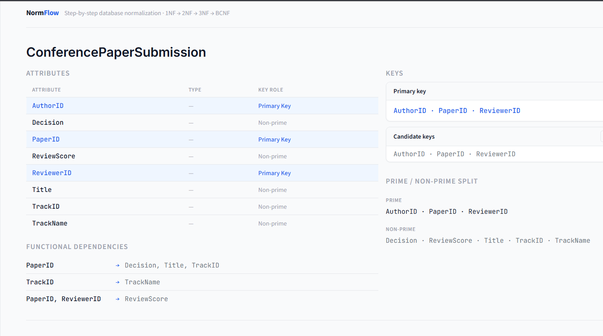
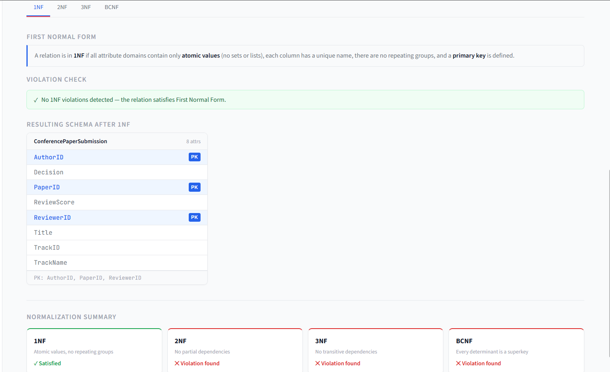

# 🌀 NormFlow – Database Normalization Engine

**NormFlow** is an interactive tool designed to bridge the gap between database theory and practical implementation. It performs step-by-step normalization from **1NF to BCNF**, allowing users to visualize how complex relational schemas decompose into clean, efficient structures.

---

## 🚀 Features

* **Attribute Closure Computation:** Automatically calculate the closure for any set of attributes.
* **Candidate Key Detection:** Identify all possible candidate keys for a given relation.
* **Minimal Cover Generation:** Simplify functional dependencies to their most basic form.
* **Multi-Stage Validation:** Real-time checks for 1NF, 2NF, 3NF, and BCNF.
* **Lossless Join Decomposition:** Ensures data integrity is maintained throughout the process.
* **Interactive UI:** Built with Streamlit for a seamless, web-based user experience.

---

## 🧠 Concepts Implemented

The engine utilizes several core relational database algorithms:
* Functional Dependencies (FDs)
* Key Discovery using attribute closure properties
* Decomposition Logic (resolving transitive and partial dependencies)
* Lossless Join & Dependency Preservation checks

---

## ⚙️ Tech Stack

* **Language:** Python
* **Framework:** Streamlit

---

## 🖥️ How It Works

1.  **Input:** Define your attributes (e.g., `A, B, C, D`) and Functional Dependencies (e.g., `A -> B, B -> C`).
2.  **Analyze:** The engine computes candidate keys and identifies the current Normal Form.
3.  **Decompose:** If violations are found, the engine triggers a step-by-step decomposition.
4.  **Result:** View the final set of tables that satisfy the target Normal Form.

---

## ▶️ Run Locally

```bash
pip install streamlit
streamlit run assignment.py
```

---

## 📸 Preview

### Schema & Key Analysis


### Normalization Output (1NF → BCNF)


---

## 📌 Example Use Case

* Analyze a relation with given functional dependencies  
* Identify candidate keys  
* Automatically normalize step-by-step  
* Understand decomposition logic visually  

---

## 📚 Learning Value

This project demonstrates:
* **Algorithmic Thinking:** Implementing discrete math and set theory for attribute closures.
* **Database Integrity:** Understanding the rigorous requirements of lossless joins.
* **Practical Implementation:** Translating theoretical concepts into functional code.mplementing discrete math and set theory for attribute closures.
* **Database Integrity:** Understanding the rigorous requirements of lossless joins.
* **Practical Implementation:** Translating theoretical concepts into functional code.
